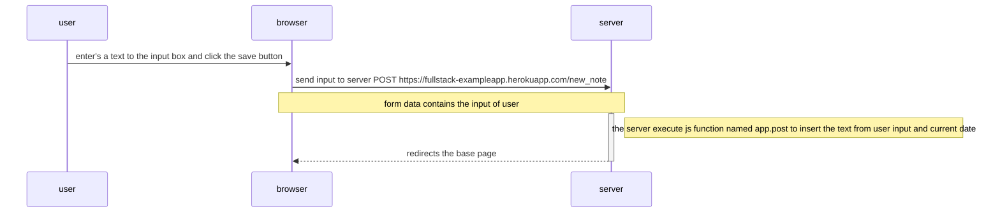

```mermaid
sequenceDiagram 
    participant user
    participant browser
    participant server

    user->>browser: enter's a text to the input box and click the save button
    browser->>server: send input to server POST https://fullstack-exampleapp.herokuapp.com/new_note
    Note over browser,server: form data contains the input of user
    activate server
    Note right of server: the server execute js function named app.post to insert the text from user input and current date
    server-->>browser: redirects the base page
    deactivate server
```