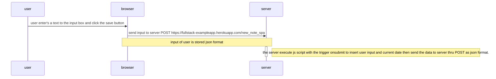

```mermaid
sequenceDiagram
    participant user
    participant browser

    user->>browser: user enter's a text to the input box and click the save button
    browser->>server: send input to server POST https://fullstack-exampleapp.herokuapp.com/new_note_spa
    Note over browser,server: input of user is stored json format
    activate server
    Note right of server: the server execute js script with the trigger onsubmit to insert user input and current date then send the data to server thru POST as json format.
    deactivate server
```